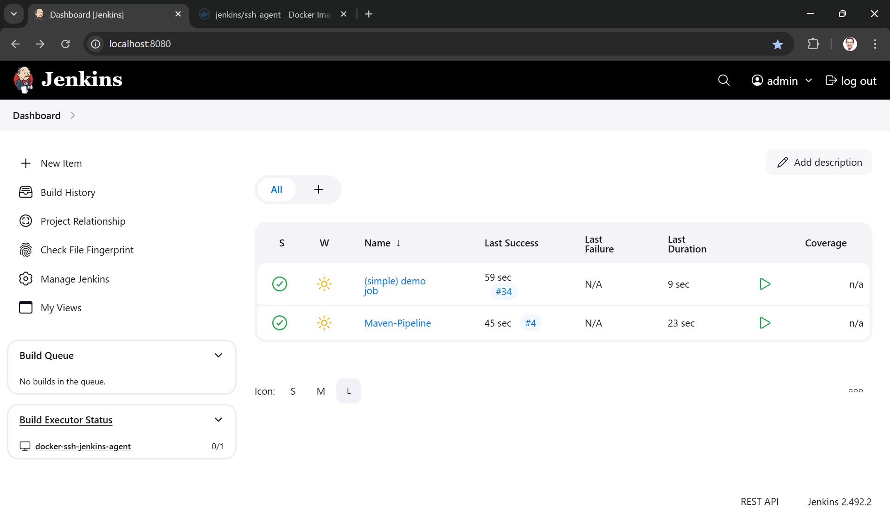
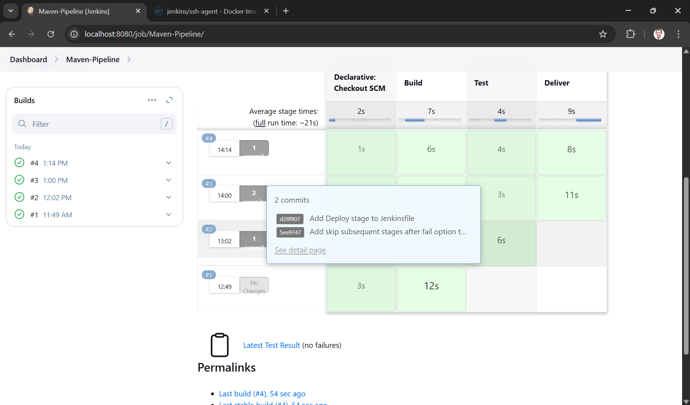
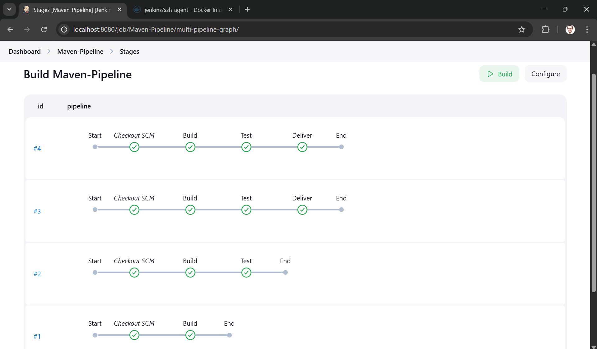
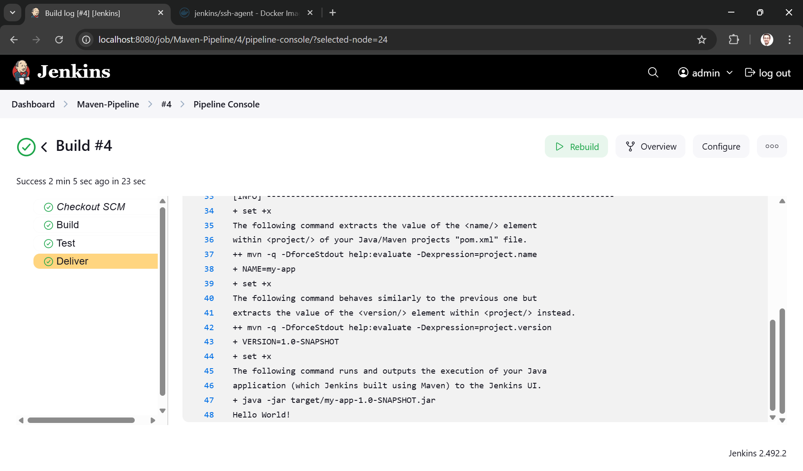

# Using Jenkins Pipelines to Build, Test, Deploy a Java Maven App







This repository is for the
[Build a Java app with Maven](https://jenkins.io/doc/tutorials/build-a-java-app-with-maven/)
tutorial in the [Jenkins User Documentation](https://jenkins.io/doc/).

The repository contains a simple Java application which outputs the string
"Hello world!" and is accompanied by a couple of unit tests to check that the
main application works as expected. The results of these tests are saved to a
JUnit XML report.

The `jenkins` directory contains an example of the `Jenkinsfile` (i.e. Pipeline)
you'll be creating yourself during the tutorial and the `jenkins/scripts` subdirectory
contains a shell script with commands that are executed when Jenkins processes
the "Deliver" stage of your Pipeline.

## Instructions
Clone the project:
```bash
git clone https://github.com/vurg/simple-java-maven-app.git
```
It has been forked from: https://github.com/jenkins-docs/simple-java-maven-app

Also clone the Jenkins controller:
```bash
git clone https://github.com/jenkins-docs/quickstart-tutorials.git
```

Start the Jenkins controller:
```bash
docker compose --profile maven up -d
```
Verify that it is running on http://localhost:8080.


Create your Pipeline project in Jenkins
1. In Jenkins, select New Item under Dashboard > at the top left.
2. Enter your new Pipeline project name in Enter an item name.
3. Scroll down if necessary and select Pipeline, then select OK at the end of the page.
4. (Optional) Enter a Pipeline Description.
5. Select Pipeline on the left pane.
6. Select Definition, and then choose the Pipeline script from SCM option. This option instructs Jenkins to obtain your Pipeline from the source control management (SCM), which is your forked Git repository.
7. Choose Git from the options in SCM.
8. Enter the URL of your repository in Repositories/Repository URL. This URL can be found when clicking on the green Code button in the main page of your GitHub repo.
9. Select Save at the end of the page. You’re now ready to create a Jenkinsfile to check into your locally cloned Git repository.

After making local changes, push to GitHub Remote. Select **Build Now** to trigger pipeline.

Clean up environment:
```bash
docker compose --profile maven down -v --remove-orphans
```